# MordomoOS — Plano de evolução (setembro 2026, v0.5 → v1.0)

> Análise do sistema rodando, do código (core, API, Command Centre) e do
> ecossistema de "Agentic OS" no GitHub em set/2026, convertida num plano de
> melhorias por ondas, com uma proposta de identidade visual "HUD" (estilo
> JARVIS) que aproveita a infraestrutura de animação que o projeto já tem.

## Sumário

1. [Como este plano foi feito](#1-como-este-plano-foi-feito)
2. [O sistema rodando — o que os prints mostram](#2-o-sistema-rodando--o-que-os-prints-mostram)
3. [Diagnóstico: forte × onde dói no dia a dia](#3-diagnóstico-forte--onde-dói-no-dia-a-dia)
4. [MordomoOS × ecossistema (OpenClaw, Hermes, OpenFang, AIOS)](#4-mordomoos--ecossistema)
5. [O plano em ondas](#5-o-plano-em-ondas)
6. [Identidade visual "HUD Mordomo" (JARVIS)](#6-identidade-visual-hud-mordomo-jarvis)
7. [Backlog priorizado](#7-backlog-priorizado)
8. [Estado da implementação](#8-estado-da-implementação-04092026-v060)
9. [Métricas de sucesso e riscos](#9-métricas-de-sucesso-e-riscos)

---

## 1. Como este plano foi feito

| Etapa | O que foi feito |
|---|---|
| Código | Leitura de `core/src` (runs, memória, rotinas, conectores, segurança), `apps/api/src` (rotas, SSE, CLI) e `apps/command-centre/src` (154 arquivos: desktop, brain, runs, views, tema). |
| Sistema rodando | `setup --defaults`, 3 pastas indexadas (98 arquivos), serviço em `127.0.0.1:4777`, **duas execuções reais com o Claude Code**: um prompt manual (7,1 s, US$ 0,056) e a skill `workspace-digest` (64 s, US$ 0,27, gerou `digest.md`). |
| Prints | 30 capturas com Playwright em 1440×900, 1024×768 e 390×844, tema escuro e claro, paleta ⌘K, notificações, execução ao vivo, detalhe de run, skill, Segundo Cérebro com busca. **Zero erros no console** em todas as rotas. |
| Ecossistema | OpenClaw (gateway + 29 canais + voz + canvas), Hermes Agent (memória curada, skills que se auto-melhoram, cron com memória, subagentes, wake word), OpenFang (Hands autônomas, 16 camadas de segurança), AIOS (kernel/scheduler), openclaw-jarvis-ui (orb Three.js com estados, áudio-reativo), awesome-agentOS. |
| Histórico | `docs/analysis-2026-09` e `docs/audit-2026-09` foram lidos para não repetir o que já foi entregue no 0.4/0.5 e para resgatar o que ficou aberto (widgets declarativos, arestas semânticas, consolidação autônoma, MCP server, plugins, multi-agente, vetores, binário único). |

Fontes externas consultadas: [OpenClaw](https://github.com/openclaw/openclaw), [Hermes Agent](https://github.com/nousresearch/hermes-agent) e sua [visão de features](https://hermes-agent.nousresearch.com/docs/user-guide/features/overview), [OpenFang](https://github.com/RightNow-AI/openfang), [AIOS](https://github.com/agiresearch/AIOS), [openclaw-jarvis-ui](https://github.com/jincocodev/openclaw-jarvis-ui), [awesome-agentOS](https://github.com/Egv2/awesome-agentOS), [10 best open-source AI agents 2026](https://dev.to/sonotommy/10-best-open-source-ai-agents-for-2026-2l6p), [What is OpenClaw (DigitalOcean)](https://www.digitalocean.com/resources/articles/what-is-openclaw).

---

## 2. O sistema rodando — o que os prints mostram

### 2.1 Desktop (1440×900, escuro)

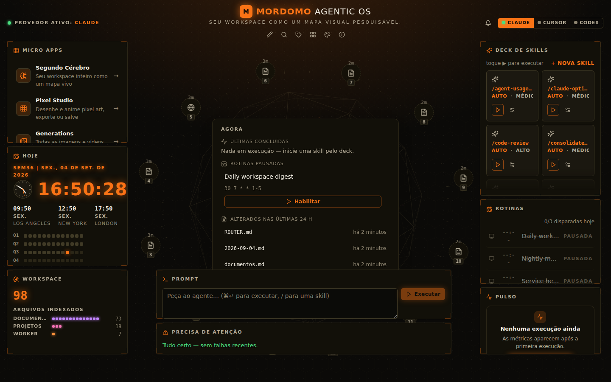

O que funciona: identidade forte (laranja HUD sobre preto quente, relógio com brilho, anel de artefatos numerado, globo em wireframe), o painel **Agora** nunca fica vazio, ⌘K abre uma paleta completa.

O que dói:

- **Widgets cortados mesmo em 1440 px**: "Micro apps" corta "Generations", o "Deck de skills" mostra meia linha de cards, "Rotinas" corta a terceira linha. A grade fixa força altura; o conteúdo não cabe.
- **Chips do anel atrás dos widgets**: os chips 11, 2 e 12 ficam escondidos atrás do Prompt e do "Precisa de atenção". O anel e a grade não negociam espaço.
- **Bordas tracejadas** em todos os widgets passam sensação de "modo edição" permanente, não de painel final.
- **Fuso horário**: o relógio mostra 16:50 (UTC) enquanto as rotinas estão em `America/Sao_Paulo`. O `setup --defaults` mantém `timezone: "UTC"` (`core/src/config/schema.ts:110`); a sugestão de fuso local só acontece no modo interativo (`apps/api/src/cli.ts:637`).
- **Terço inferior da tela vazio** enquanto os widgets cortam conteúdo em cima.

### 2.2 Desktop com uma execução ao vivo

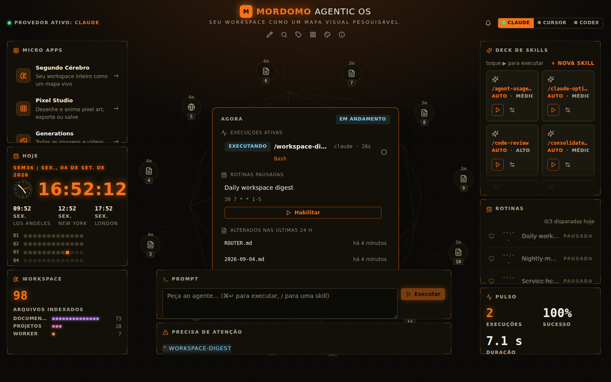

O "Agora" vira **EM ANDAMENTO**, mostra a tool atual (`Bash`) e o tempo. Bom. Mas:

- "**Precisa de atenção**" lista `WORKSPACE-DIGEST` só porque ela está rodando. O widget de alerta vira ruído: atenção deve significar falha, aprovação pendente ou custo estourado.
- Nada no globo/anel reage à execução: o único sinal de "vida" é texto. A camada visual mais cara do desktop (o canvas) fica muda justamente quando há algo acontecendo.
- O prompt é **one-shot**: não há como responder ao agente, nem ver a resposta ali. O usuário precisa ir em Execuções.

### 2.3 Tema claro e tablet

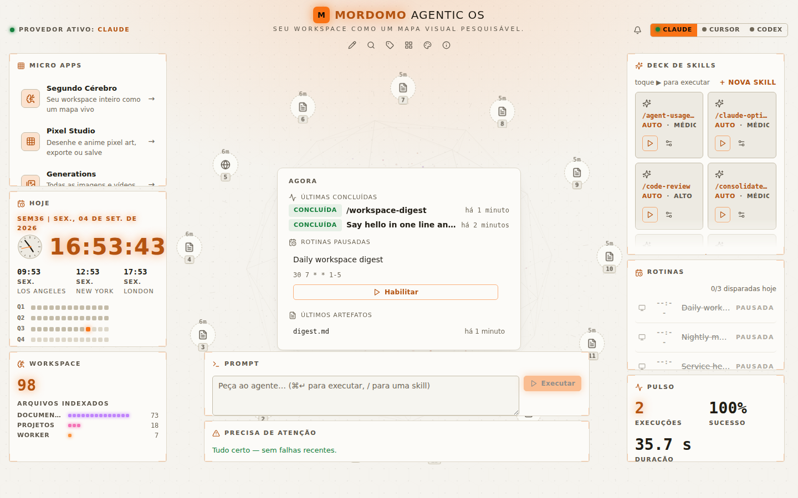
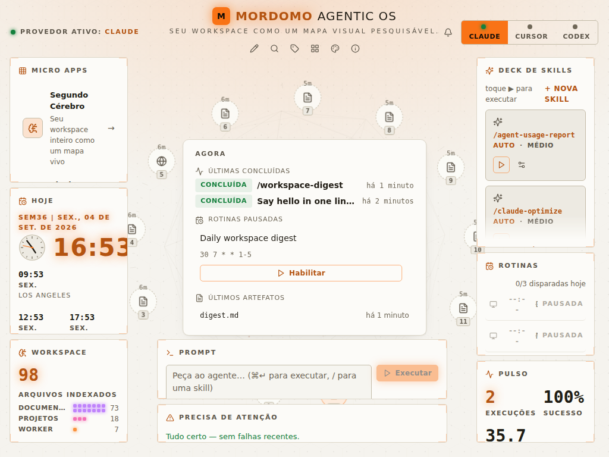

- No claro, o globo e as estrelas somem, os chips perdem brilho e o relógio laranja com glow fica borrado sobre bege. O tema claro é um tema escuro invertido, não um tema desenhado.
- Em 1024 px os chips do anel (3, 4, 10, 11) ficam sobre os widgets e os cards do deck cortam.

### 2.4 Mobile (390×844)

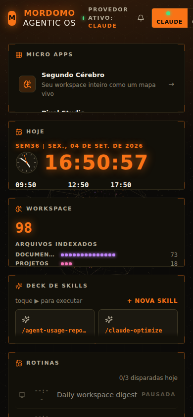

Os widgets empilham (via `STACK_BREAKPOINT` em JS, não via CSS), mas: cabeçalho quebra em três linhas, cada widget continua cortando o conteúdo, não há navegação inferior, o anel e o globo somem sem substituto. O OS não é usável no celular hoje.

### 2.5 Segundo Cérebro

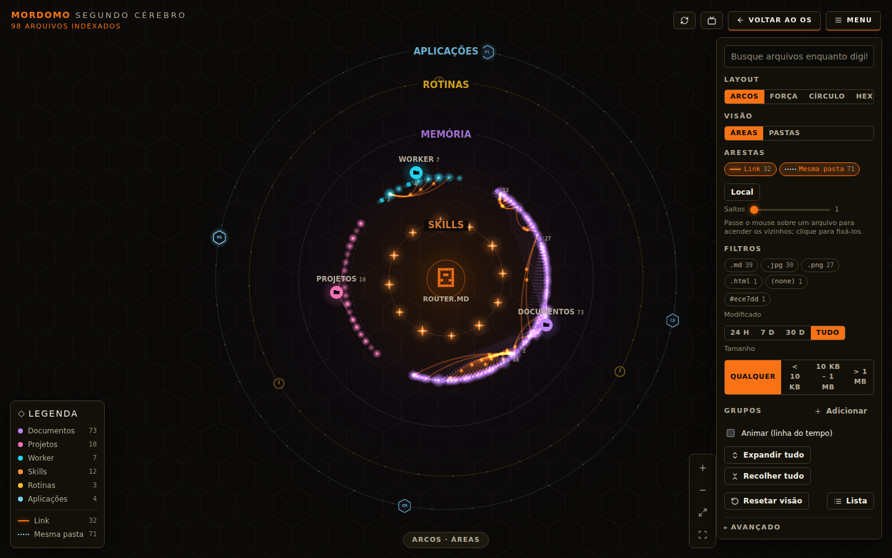
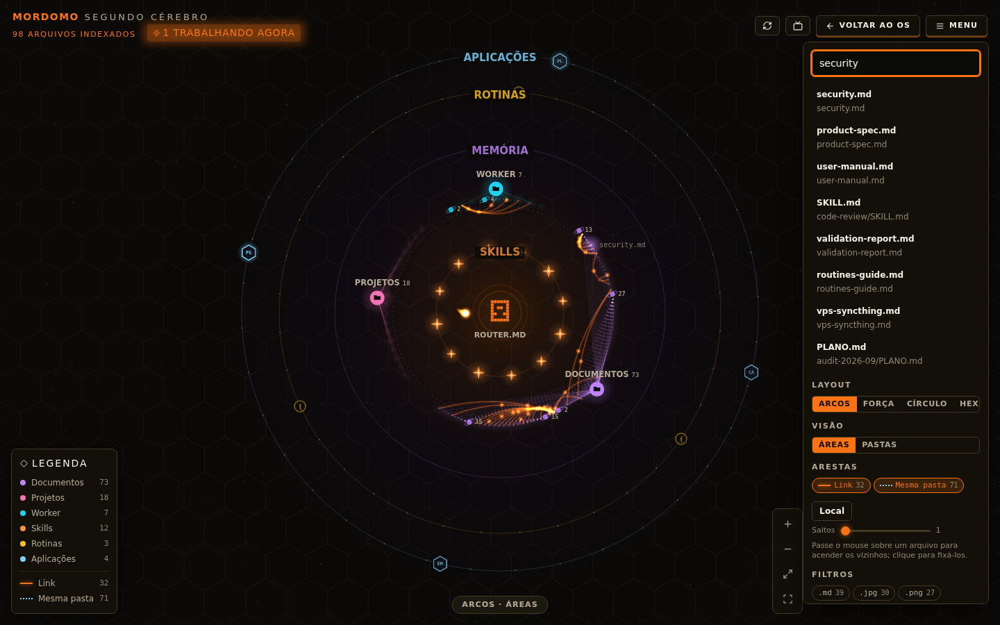

A melhor superfície do produto: arcos por área, arestas tipadas, busca que reduz o grafo aos hits, legenda, "1 trabalhando agora" durante uma execução. Pontos a resolver:

- **Todos os rótulos ligados** vira uma mancha ilegível (print `brain-light.png`): precisa de colisão de rótulos ou nível de detalhe por zoom.
- O canvas é cego ao teclado além do `aria-label`; não há como percorrer nós sem mouse (`views/SecondBrain.tsx`).
- Física (`d3-force`) e render rodam na thread principal; a migração para Worker/OffscreenCanvas ficou pendente na auditoria anterior.
- O nó que o agente está lendo **não acende**: o stream do Claude entrega `tool_use` com caminhos (`Read`, `Grep`), mas o brain não recebe esse evento.

### 2.6 Execuções, detalhe e skill

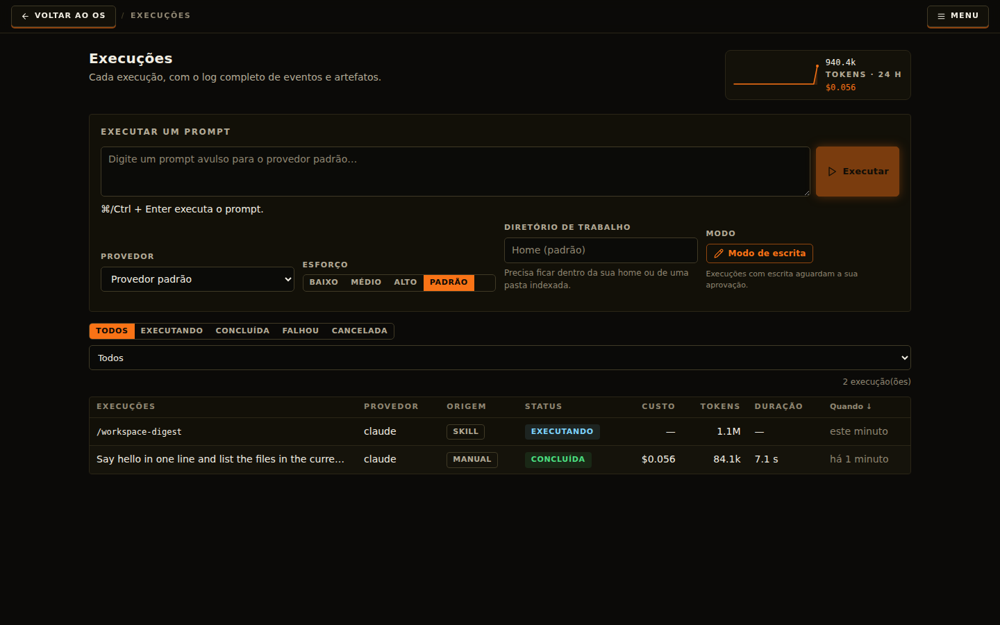
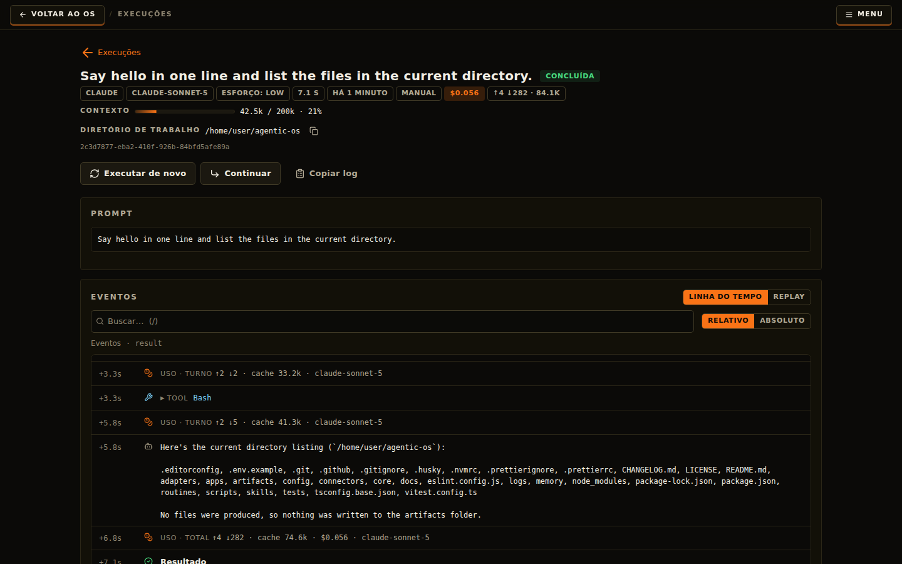
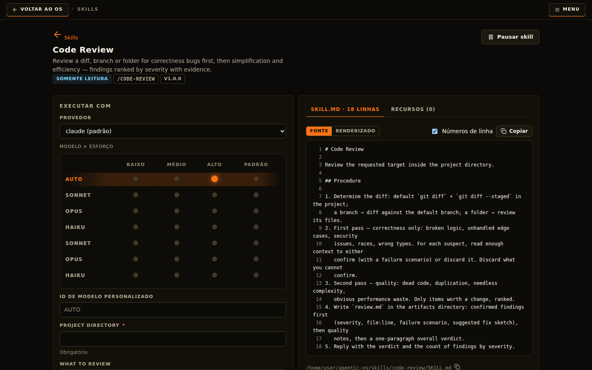

- O detalhe da execução é excelente (custo, contexto 42,5k/200k, timeline com busca, replay, "Continuar").
- **Custo escondido**: um "olá" leu 74,5k tokens de cache e custou US$ 0,056; o digest leu 655k de cache e custou US$ 0,27. Não há orçamento diário, alerta, nem explicação de por que o contexto inicial é tão pesado.
- **"Continuar"** cria um run novo com o prompt anterior; não retoma a sessão (`--resume` do Claude não é usado em `adapters/claude/src/index.ts`).
- Na matriz **Modelo × Esforço**, SONNET/OPUS/HAIKU aparecem duas vezes: o adapter lista os aliases e os ids completos como modelos separados (`adapters/claude/src/index.ts:103-108`).
- O artefato `digest.md` aparece na galeria como ícone genérico, sem preview do markdown.

### 2.7 Rotinas, conectores, paleta, configurações, notificações

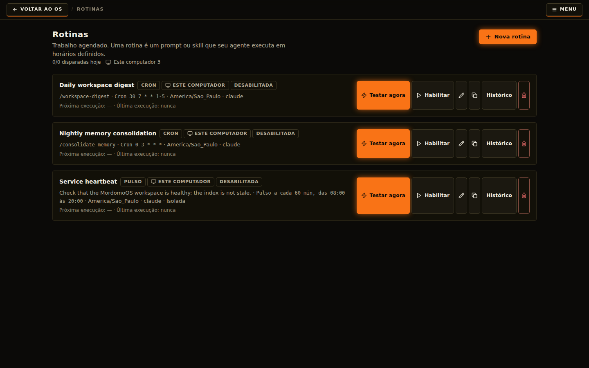
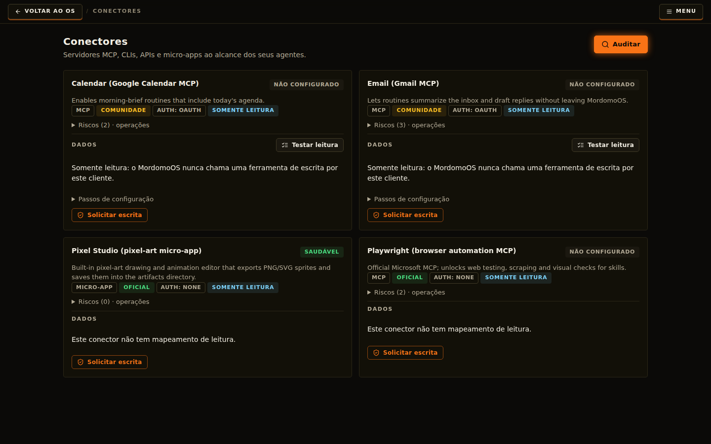
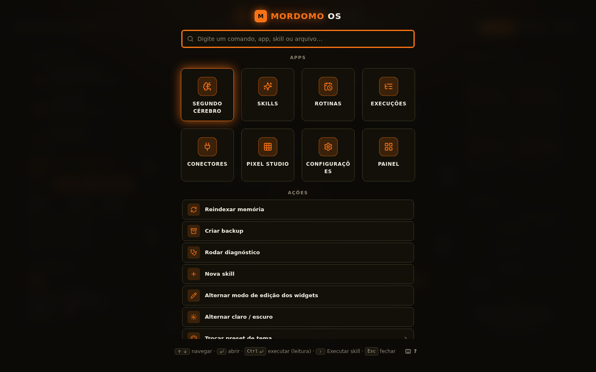
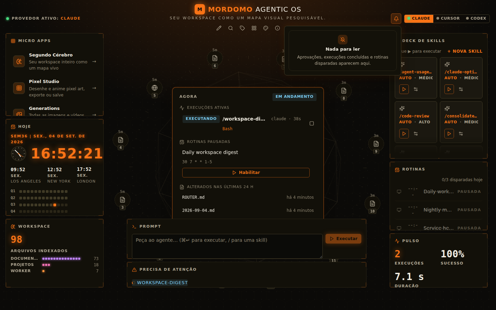

- Rotinas: as três vêm **desabilitadas** por padrão e nada guia o usuário a habilitar a primeira (o painel Agora sugere, mas só uma). "Testar agora" com destaque laranja em cada linha compete com a ação principal.
- Conectores: a página é honesta ("somente leitura") mas termina em "Solicitar escrita" sem um caminho de setup guiado (OAuth do Google, por exemplo, exige passos fora do OS).
- Paleta: ótima. Falta busca com acentos normalizados e `aria-activedescendant`.
- Notificações: vivem só nesta aba (`localStorage`); fechou a aba, perdeu. Sem notificação de sistema, push ou canal.
- `/api/meta` reporta versão **0.1.0** (lê `apps/api/package.json`, que nunca foi bumpado) enquanto a raiz está em 0.5.0.

---

## 3. Diagnóstico: forte × onde dói no dia a dia

### O que é genuinamente forte (manter e proteger)

- **Ciclo de vida de execução**: máquina de estados com UPDATE condicional, cancelamento registrado antes do spawn, SIGTERM→SIGKILL, recuperação por `/proc/<pid>/cmdline` (`core/src/runs/runManager.ts`).
- **Segurança**: argv-only com allowlist, contenção de caminhos com realpath, redação antes de persistir, perfis por origem, backup online do SQLite e restore em staging.
- **Memória**: recall em camadas determinístico (BM25 + routers + seções + 1 salto), journal diário, fatos bi-temporais, higiene.
- **Frontend**: TanStack Query com chaves centralizadas, um único SSE fan-out, focus trap com `inert`, `prefers-reduced-motion` respeitado até nos canvases, View Transitions, sem lib de animação (e não precisa).
- **Vendor-neutral sobre CLIs**: nenhum concorrente pesquisado roda por cima de Claude Code, Cursor e Codex com o mesmo catálogo de skills e o mesmo compilador de sync.

### Onde dói no uso diário (ordenado por impacto)

| # | Dor | Evidência |
|---|---|---|
| D1 | **Não há conversa.** Cada run é um tiro único; não dá para responder, corrigir rumo, aprovar uma tool no meio. | `core/src/agents/types.ts:38` sem sessão; nenhum adapter usa `--resume`/`--continue`; "Continuar" reenvia o prompt. |
| D2 | **O OS não toma iniciativa.** Rotinas são cron; conectores só alimentam widgets; nada observa → decide → age. | `scheduler.ts:296` (`on-exit` só por skill); `connectors/client.ts:96` read-only por construção. |
| D3 | **Só existe no desktop grande.** Tablet/celular cortam e sobrepõem. | prints 2.3/2.4; `desktop.css` sem nenhuma media query. |
| D4 | **Custo invisível até doer.** Sem orçamento, sem alerta, sem "modo econômico". | US$ 0,27 por digest; `/api/metrics` existe mas ninguém age sobre ele. |
| D5 | **Notificações presas na aba.** | `hooks/useNotifications.ts:37`. |
| D6 | **Atenção mal calibrada.** Widget de alerta lista runs em andamento; "Nada para ler" na maioria do tempo. | `AttentionWidget.tsx`. |
| D7 | **Onboarding termina em UTC, rotinas pausadas e cérebro vazio** quando se usa `--defaults`. | `schema.ts:110`, `routines/*.json` `enabled:false`. |
| D8 | **Sem voz, sem canais, sem acesso remoto.** | Host check em `server.ts:52` rejeita qualquer host não-loopback mesmo após `expose_port`. |
| D9 | **Tema claro não é um tema.** | print 2.3. |
| D10 | **Dívida de performance que vai aparecer com uso**: `runs` cresce sem limite, SQLite síncrono por evento, SSE consulta o DB por evento por cliente, `activeRunCount` lista 200 linhas, approvals nunca expiram, rebuild dos sprites do canvas a cada resize, `setState` durante render. | `runManager.ts:187/633`, `routes/runs.ts:127`, `context.ts:238`, `approvals.ts:48`, `Wallpaper.tsx:407`, `WidgetLayer.tsx:57`. |

---

## 4. MordomoOS × ecossistema

| Capacidade | MordomoOS 0.5 | OpenClaw | Hermes Agent | OpenFang | AIOS |
|---|---|---|---|---|---|
| Conversa contínua com sessão | ✗ (one-shot) | ✓ | ✓ (compressão de contexto, linhagem de sessão) | ✓ | ✓ |
| Roda sobre CLIs de terceiros (Claude/Cursor/Codex) | **✓ único** | ✗ (próprio runtime) | ✗ | ✗ | ✗ |
| Canais (WhatsApp/Telegram/Discord…) | ✗ | ✓ 29 | ✓ | ✓ 40 | ✗ |
| Voz (STT/TTS, wake word) | ✗ | ✓ | ✓ | parcial | ✗ |
| Memória persistente curada | ✓ (router + journal + fatos) | ✓ (journal + "dreaming") | ✓ (MEMORY.md/USER.md) | ✓ (SQLite + vetor) | ✓ |
| Skills que se auto-melhoram | ✗ (manual) | parcial | **✓** | ✗ | ✗ |
| Cron / heartbeat / on-exit | ✓ 5 tipos | ✓ | ✓ com memória entre runs | ✓ Hands | scheduler |
| Subagentes / fan-out | ✗ | ✓ | ✓ | ✓ | ✓ |
| Sandbox / perfis de segurança | ✓ perfis + approvals | parcial | checkpoints | ✓ 16 camadas, WASM | ✓ |
| Dashboard / HUD | ✓ desktop + Second Brain (**melhor visual**) | Control UI simples | web dashboard | Tauri | web/TUI |
| Marketplace | ✗ | ✓ ClawHub | ✓ awesome-hermes | ✗ | ✗ |
| Custo/tokens por run | ✓ | parcial | parcial | ✓ | ✓ |
| Acesso remoto / mobile | ✗ | ✓ | ✓ | ✓ | – |
| Expor-se como MCP server | ✗ | ✓ | ✓ | – | – |

Leitura: o MordomoOS **vence** em neutralidade de fornecedor, segurança de execução e visualização da memória. **Perde** em conversa, proatividade, alcance (canais/voz/mobile) e ecossistema. A ordem das ondas abaixo segue exatamente essa lacuna.

---

## 5. O plano em ondas

Cada onda é entregável sozinha. Esforço estimado para uma pessoa com o agente ajudando.

### Onda 0 — Correções e dívida que atrapalha (1 semana)

Objetivo: o que existe fica redondo antes de crescer.

| Item | Arquivo(s) | Aceite |
|---|---|---|
| Fuso padrão = fuso da máquina também em `--defaults` | `apps/api/src/cli.ts:637`, `schema.ts:110` | relógio e rotinas no mesmo fuso após setup |
| Deduplicar modelos (alias = id) na matriz | `adapters/claude/src/index.ts:103-108`, `SkillDetail.tsx` | 3 linhas de modelo, aliases como sub-rótulo |
| Widgets com altura por conteúdo + scroll interno; nunca cortar texto | `desktop/desktop.css`, `defaultLayout.ts` | print 2.1 sem clipping |
| Anel de artefatos respeita a grade (raio calculado a partir da área livre) | `Wallpaper.tsx:474` | nenhum chip sob widget em 1024/1440 |
| "Precisa de atenção" só lista falha, aprovação, custo, rotina silenciosa | `AttentionWidget.tsx` | run em andamento não aparece |
| Preview de markdown/texto na galeria de artefatos | `views/Artifacts.tsx:47` | `digest.md` mostra as primeiras linhas |
| Versão única (raiz) em `/api/meta` | `routes/system.ts:25` | UI mostra 0.5.x |
| `onMetrics` em `useEffect`; MutationObserver filtra só `--cell-*` | `WidgetLayer.tsx:57`, `Wallpaper.tsx:407`, `BrainCanvas.tsx:107` | resize sem rebuild de sprites |
| `activeRunCount` via `count()`; SSE sem query por evento | `context.ts:238`, `routes/runs.ts:127` | `/api/health` O(1) |
| Retenção de `runs`/`routine_history` + `VACUUM` semanal | `runManager.ts:187` | DB estável após 30 dias |
| Approvals expiram (TTL) e `waiting_approval` vira status real | `approvals.ts`, `runManager.ts:18` | pendências antigas somem sozinhas |
| Slot de concorrência re-checa o limite ao liberar | `runManager.ts:806-824` | baixar o limite em runtime funciona |
| `SettingsView` tipado (uma interface compartilhada) | `queries.ts:110`, `Settings.tsx:19` | zero `as unknown as` nos consumidores |
| Bump dos `package.json` dos workspaces | raiz e 5 workspaces | versões iguais |

### Onda 1 — Sessões e conversa (2–3 semanas)

Objetivo: o Prompt vira um **Console** com o agente, e a execução deixa de ser um tiro único. É o pré-requisito de tudo que vem depois.

1. **Modelo de sessão** no core: tabela `sessions` (id, provider, providerSessionId, cwd, profile, título, tokens acumulados), `runs.session_id`. Migração 5.
2. **Adapters com retomada**: Claude via `-p --resume <id> --input-format stream-json --output-format stream-json` (confirmado no `claude --help` instalado); Codex via `codex exec resume`; Cursor onde o CLI permitir. Primeiro run cria a sessão; os seguintes retomam.
3. **Aprovação de tool no meio do run**: usar `--permission-prompt-tool`/`--permission-prompts` do Claude para transformar o pedido de permissão em `approval.pending` no bus; a UI resolve inline (o componente já existe em Runs) e o run continua. Hoje o headless nega tudo (`adapters/claude/src/index.ts:135-149`).
4. **Console no desktop**: o widget Prompt vira uma thread (mensagens do usuário, respostas resumidas, chips de tool, custo acumulado), com "interromper", "corrigir rumo" e "abrir no Execuções". Sessões recentes na paleta ⌘K.
5. **Transcript → journal**: fim de sessão gera entrada no journal do dia com decisões e arquivos tocados (a infra `journal.ts` já recebe runs).
6. Testes: sessão retomada com fake-bin, aprovação mid-run, SSE `Last-Event-ID` no meio de uma sessão.

### Onda 2 — Proatividade e alcance mínimo (2–3 semanas)

Objetivo: o OS **trabalha enquanto você não olha** e te avisa onde você está.

1. **Sentinelas**: observadores baratos (sem LLM) que emitem eventos: mudança em pasta indexada, delta nos dados de conector (novo e-mail/evento), run falhou 2×, custo do dia > orçamento, rotina silenciosa. Config em JSON como as rotinas.
2. **Triagem**: um evento de sentinela dispara um run curto com modelo barato (`haiku`) e orçamento fixo, que devolve `ignorar | notificar | propor ação | executar (se perfil permitir)`. O resultado vai para o Inbox.
3. **Inbox unificado** (substitui "Precisa de atenção" e o sino): aprovações, alertas de sentinelas, digests, sugestões de skill, falhas. Cada item com ação inline. Persistido no SQLite, não no `localStorage`.
4. **Notificações fora da aba**: Web Notifications + Service Worker (PWA) e notificação de SO via `node-notifier` no serviço; canal externo opcional começando por **Telegram** (bot token no `.env`, webhook de entrega já existe nas rotinas).
5. **Orçamento**: limite diário/semanal em `settings.limits`; barra no widget Custo; ao atingir 80 % o Inbox avisa; a 100 % novos runs manuais pedem confirmação e rotinas de perfil `read_only` continuam.
6. **Heartbeat com memória**: o heartbeat passa a receber o resumo do anterior (o Hermes faz isso) para não repetir alertas.
7. **Onboarding dia 1**: ao terminar o setup, habilitar o `daily-workspace-digest` com um clique e sugerir 1 pasta real; o painel Agora mostra o "próximo passo" até o dia 7 do plano de adoção.

### Onda 3 — Alcance total: remoto, mobile, voz, MCP, subagentes (3–4 semanas)

1. **Acesso remoto seguro**: pareamento por código (device tokens com escopo e expiração), TLS auto-assinado ou Tailscale, e o host check passa a aceitar hosts pareados (`server.ts:52`). Aprovação `expose_port` já existe.
2. **Layout mobile/PWA**: navegação inferior (Agora, Console, Inbox, Cérebro, Mais), widgets em cards de altura livre, sem anel/globo (substituídos por um "núcleo" pequeno no topo), instalável.
3. **Voz**: STT local via Web Speech API no Console (botão segurar-para-falar), TTS via `speechSynthesis` para respostas curtas e alertas do Inbox; wake word opcional depois (o Hermes usa "Hey Hermes").
4. **MordomoOS como MCP server** (`mordomo mcp`): expõe `recall`, `skills.list/run`, `journal.append`, `facts.query` para os próprios CLIs. Fecha o ciclo: o agente rodando no Cursor consulta a memória do Mordomo.
5. **Subagentes**: `parent_run_id` vira fan-out real (uma skill pode disparar N runs filhos com `cwd` diferentes e aguardar); vista "Esquadrão" no Execuções com a árvore.
6. **Marketplace mínimo**: registro git (um repositório de skills com `manifest.json` assinado), `mordomo skill install <url>`, versão e diff antes de sobrescrever.

### Onda 4 — Memória viva e auto-melhoria (contínua)

1. **Consolidação noturna autônoma** ("sleep-time"): a rotina `nightly-consolidation` habilitada por padrão em perfil `review_before_write`, com diff das promoções para aprovar de manhã no Inbox.
2. **Detector "fez duas vezes → vira skill"**: agrupar prompts semelhantes (BM25 sobre `promptSummary`) e propor uma skill pré-preenchida no Inbox. É a regra do manual, automatizada.
3. **Embeddings locais opcionais** (`sqlite-vec` + modelo pequeno via `transformers.js` no serviço): arestas semânticas "relacionado por conteúdo" no Cérebro, ao lado das arestas tipadas atuais.
4. **Skills que aprendem**: cada run de skill pode anexar "lições" (seção `## Notas do agente` no SKILL.md com data), revisáveis; versão da skill sobe automaticamente.
5. **Cérebro no Worker**: física e layout em Web Worker, render com OffscreenCanvas; colisão de rótulos e nível de detalhe por zoom.

### Transversal (em todas as ondas)

- Cobertura de testes com limiar no CI (`vitest --coverage`, mínimo 70 % em `core`), e2e do fluxo run→aprovação→artefato.
- `theme.css` (4.197 linhas) dividido em `tokens.css`, `primitives.css`, `shell.css` e um arquivo por app.
- Remover `lazyOptional`/`MissingApp` e o hook `useApi` legado.
- Chaves de query dos runs por página (`qk.runs`), não prefixo global.

---

## 6. Identidade visual "HUD Mordomo" (JARVIS)

### 6.1 Princípios

1. **Vitalidade**: o sistema mostra que está pensando. Todo evento do bus (`run.started`, `tool_use`, `approval.pending`, `run.finished`) tem uma tradução visual no núcleo.
2. **Profundidade**: três camadas fixas: fundo (canvas), instrumentação (HUD overlay) e conteúdo (widgets/apps). Efeito nunca por cima de texto.
3. **Instrumentação**: dados aparecem como telemetria (mono, tabular, rótulos em caixa alta com tracking), não como cards de admin.
4. **Contenção**: tudo em `transform`/`opacity`/canvas, nada de `box-shadow` animado; `prefers-reduced-motion` desliga tudo (já é assim); um único token `--hud-intensity` (0 a 1) por preset controla scanlines, vinheta, brackets e varredura, e `0` desliga.

Custo em bundle: **zero libs novas**. Tudo cabe no canvas do `Wallpaper.tsx` (já DPR-aware, com orçamento de frame e cache de sprites), em CSS com tokens e nos hooks existentes (`usePresence`, `useTweenNumber`, `useViewTransition`, `subscribeOsEvents`).

### 6.2 O Núcleo (core orb) — o coração do JARVIS

Substitui o icosaedro por um **reator**: 3 anéis concêntricos + arcos segmentados + partículas, desenhado no `draw()` do `Wallpaper.tsx` e alimentado por `useEventStream`. Estados:

| Estado | Fonte | Visual |
|---|---|---|
| **Repouso** | nenhum run | respiração de 6 s (raio ±2 %), arco lento (1 volta/90 s), 12 fps |
| **Ouvindo** | foco no Console / mic | anel externo ondula com a amplitude do mic (`AnalyserNode`) |
| **Pensando** | `run.started` … primeiro `assistant` | arcos segmentados giram em sentidos opostos, partículas convergem ao centro, 60 fps |
| **Executando tool** | `tool_use` | um blip sai do núcleo na direção do chip/nó do arquivo tocado; o nome da tool aparece em mono ao lado |
| **Respondendo** | `assistant` com texto | pulsos radiais sincronizados com o streaming; se TTS ligado, waveform no anel interno |
| **Alerta** | `run.failed`, `approval.pending`, orçamento | matiz muda para âmbar/vermelho, ticks aceleram, brackets do HUD piscam 2× |
| **Concluído** | `run.finished` | flash de 300 ms + anel se expande e desvanece; o artefato novo "nasce" no anel de chips vindo do centro |

Implementação: `Wallpaper.tsx` já tem `dirtyUntil` (linha 151) para acordar o loop; basta `subscribeOsEvents` atualizar um `coreState` em `ref` e marcar sujo. A "explosão" de hub do Cérebro já é um precedente de animação determinística.

### 6.3 Camada HUD global

Um `
` entre `.depth-layer` e a paleta em `OsShell` (`App.tsx:294-343`), `pointer-events: none`:

- **Scanlines** (`repeating-linear-gradient`, opacidade 0,03–0,05) e **vinheta** radial.
- **Brackets de canto** (4 cantos, 1 px, cor do acento, 40 % de opacidade) que se contraem ao abrir a paleta e se expandem ao voltar ao OS (o `data-palette`/`data-depth` no `os-root` já existem como gancho).
- **Telemetria nas bordas**: canto inferior esquerdo `RUNS 1 · TOKENS/H 84k · HOJE US$ 0,33`, canto inferior direito `MEM 98 · SKILLS 12 · ROT 1/3`, canto superior `SES 16:53:43 UTC-3`, tudo em mono 11 px com `tabular-nums` e o `useTweenNumber` para odômetro.
- **Varredura de radar**: um gradiente cônico que gira 1 vez a cada 12 s no repouso e acelera no estado Pensando.
- **Grade de fundo** já existe (pontos de 22 px); ganha uma linha de horizonte sutil com perspectiva no estado Pensando.

### 6.4 Sequência de boot

Hoje `App.tsx:139` retorna `null` enquanto carrega o meta: um frame preto. Trocar por uma tela de 900 ms (só na primeira carga da sessão):

1. Brackets desenham os cantos (stroke-dashoffset, 200 ms).
2. O núcleo "liga": ponto → anel → 3 anéis (300 ms).
3. Três linhas de telemetria digitadas em mono: `MEMÓRIA · 98 arquivos`, `SKILLS · 12 · ROTINAS 1/3`, `PROVEDOR · claude · sonnet-5` (300 ms).
4. Fade para o desktop com View Transition; som de "ack" opcional (o toggle de som já existe).

### 6.5 Tipografia

É a alavanca mais barata. `theme.css:14-18` já documenta como empacotar fontes em `public/fonts/`:

- **Display**: uma condensada técnica (Rajdhani ou Chakra Petch, subset latin, ~20 kB woff2) para títulos de widget, relógio e rótulos HUD.
- **Dados**: JetBrains Mono ou IBM Plex Mono para telemetria, ids, custos.
- **Corpo**: manter a stack de sistema (legibilidade e zero custo).

### 6.6 Micro-interações por superfície

| Superfície | Efeito | Como |
|---|---|---|
| Chips do anel | retícula de mira ao hover (4 traços que convergem), rótulo desliza | canvas (`Wallpaper.tsx`), já existe hover |
| Widgets | "materializam" ao montar: wipe de `clip-path` de cima para baixo + linha de varredura de 1 px; ao remover, dissolvem em ruído | CSS keyframe nova + `usePresence` |
| Bordas dos widgets | trocar tracejado por linha sólida de 1 px com **brackets só nos cantos** (estética de painel de instrumento) e brilho de 1 px no topo | `desktop.css:41,194` |
| Botão Executar | "carga": preenchimento radial em 150 ms no press, então dispara; enquanto roda, borda gira | CSS `:active` já existe (`theme.css`) |
| Números | odômetro com `useTweenNumber` em custo, tokens, contagem de arquivos | hook existente |
| Toasts | entram como "transmissão": linha de varredura + texto que resolve de mono para regular | `ui.tsx` toasts |
| Paleta ⌘K | abertura em íris (`clip-path: circle()`) a partir do núcleo; resultados entram com 20 ms de stagger | `CommandPalette.tsx` + `usePresence` |
| Rotas | manter View Transitions; adicionar "flash de foco" de 120 ms na borda da app aberta | `useViewTransition.ts` |
| Execuções | timeline com linha de vida pulsante enquanto roda; `tool_use` como blips numa faixa de radar horizontal; medidor de contexto como arco de reator | `EventTimeline.tsx`, `RunDetail.tsx` |
| Cérebro | paralaxe leve por mouse (2–3 px por camada), halo no nó lido pelo run ativo (mapear caminhos de `Read`/`Grep` para nós), ripple ao clicar | `BrainCanvas.tsx`, evento `tool_use` com path |
| Approvals | o card pendente "acorda" com 2 pulsos âmbar e os brackets do HUD apontam para ele | `hud-overlay` + `data-depth` |

### 6.7 Som (opt-in, já existe o toggle)

Três sons sintetizados com WebAudio (sem assets): **ack** (tique curto ao disparar), **done** (dois tons ascendentes), **alerta** (tom grave com tremolo). Nunca no estado Pensando (evita ruído contínuo).

### 6.8 Voz e "o Mordomo fala"

Com a Onda 3, o Console ganha microfone e o núcleo entra em **Ouvindo**; respostas curtas do Inbox são faladas por `speechSynthesis` com waveform no anel interno. É o que faz o openclaw-jarvis-ui parecer vivo: três visualizações reagindo ao áudio (espectro, anéis, forma de onda).

### 6.9 Presets

- **HUD Orange** (atual, padrão): laranja `#f97316` sobre preto quente.
- **JARVIS**: ciano `#4fd1ff` sobre `#07090c` (azul-frio), âmbar `#f2a93b` como secundária para alertas e custo, `--hud-intensity: 0.8`.
- **Reactor**: âmbar `#ffb454`, `--hud-intensity: 0.6`.
- **Claro (redesenhado)**: fundo `#f4f6f9` frio, núcleo em linhas escuras (sem glow), chips com sombra dura, `--hud-intensity: 0.2`.

Um controle "Intensidade do HUD" em Configurações › Tema aplica o token; presets já são `[data-preset]` em `theme.css:145-200`.

### 6.10 Regras de performance

- Canvas acorda só com evento ou hover (`dirtyUntil`), volta a 12 fps em repouso, para com aba oculta (já é assim).
- Nada de `filter: blur` animado nem `backdrop-filter` novo sobre o canvas.
- Orçamento: HUD overlay ≤ 1 ms/frame; núcleo ≤ 4 ms/frame em Pensando em máquina modesta; medir com o `performance.mark` já usado no brain.
- Tudo desliga com `prefers-reduced-motion` e com `--hud-intensity: 0`.

---

## 7. Backlog priorizado

Impacto e esforço de 1 (baixo) a 5 (alto). Ordenado por impacto/esforço.

| # | Item | Onda | Impacto | Esforço |
|---|---|---|---|---|
| 1 | Fuso local no `--defaults` | 0 | 4 | 1 |
| 2 | Widgets sem clipping + anel respeita grade | 0 | 4 | 2 |
| 3 | Atenção só para o que precisa de atenção | 0 | 3 | 1 |
| 4 | Dedupe de modelos | 0 | 2 | 1 |
| 5 | Núcleo reativo a eventos (estados Pensando/Executando/Alerta) | 6.2 | 5 | 2 |
| 6 | HUD overlay + telemetria + `--hud-intensity` | 6.3 | 4 | 2 |
| 7 | Sequência de boot | 6.4 | 3 | 1 |
| 8 | Fonte display + mono empacotadas | 6.5 | 4 | 1 |
| 9 | Sessões + `--resume` nos adapters | 1 | 5 | 4 |
| 10 | Console conversacional no desktop | 1 | 5 | 3 |
| 11 | Aprovação de tool no meio do run | 1 | 5 | 3 |
| 12 | Inbox unificado persistido | 2 | 4 | 3 |
| 13 | Sentinelas + triagem barata | 2 | 5 | 4 |
| 14 | Orçamento de custo com alerta | 2 | 4 | 2 |
| 15 | Notificações de SO/PWA + Telegram | 2 | 4 | 3 |
| 16 | Retenção do DB, approvals com TTL, `count()` | 0 | 3 | 2 |
| 17 | Layout mobile/PWA | 3 | 4 | 4 |
| 18 | Acesso remoto pareado | 3 | 4 | 4 |
| 19 | Voz (STT/TTS) no Console | 3 | 3 | 3 |
| 20 | MordomoOS como MCP server | 3 | 4 | 3 |
| 21 | Subagentes (fan-out) + vista Esquadrão | 3 | 3 | 4 |
| 22 | Marketplace mínimo de skills | 3 | 3 | 3 |
| 23 | Consolidação noturna ligada por padrão com revisão | 4 | 4 | 2 |
| 24 | Detector "fez duas vezes → skill" | 4 | 4 | 3 |
| 25 | Embeddings locais + arestas semânticas | 4 | 3 | 4 |
| 26 | Cérebro em Worker + colisão de rótulos | 4 | 3 | 4 |
| 27 | Tema claro redesenhado | 6.9 | 2 | 2 |
| 28 | Preview de markdown na galeria | 0 | 2 | 1 |
| 29 | `theme.css` dividido; remover legado | transv. | 2 | 2 |
| 30 | Cobertura de testes com limiar | transv. | 3 | 2 |

Sugestão de sequência para as próximas 2 semanas: itens 1–8 e 16 e 28 (toda a Onda 0 mais o "JARVIS visível" 5–8). O usuário sente o sistema vivo em dias, enquanto a Onda 1 começa por baixo.

---

## 8. Estado da implementação (04/09/2026, v0.7.0)

Todo o plano foi executado na mesma sessão em que foi escrito (ver
`CHANGELOG.md` 0.6.0 e 0.7.0). Nenhum item ficou pendente:

- **Onda 0 completa** (itens 1–4, 16, 28 e todos os de dívida da tabela 5).
- **Harmonia do desktop** e **HUD Mordomo** (§6 inteiro, incluindo som §6.7 e
  voz §6.8): layout de 20 linhas, widgets sem corte, escala única, núcleo
  reativo, overlay com `--hud-intensity`, telemetria, boot, preset JARVIS,
  cues sonoros de início/fim/falha, microfone e leitura em voz no Console.
- **Onda 1 completa**: sessões, `--resume`, Console conversacional, aprovação
  de tool no meio do run via MCP (`mordomo mcp permission`), `mordomo mcp`
  para qualquer cliente, transcript → journal com gist.
- **Onda 2 completa**: orçamento diário, inbox persistido, sentinelas
  (falha repetida, rotina silenciosa, delta de conector, "fez duas vezes",
  fs-watch) com triagem barata, notificações de sistema e faladas fora da
  aba, Telegram, próximo passo do dia 1 no painel Agora.
- **Onda 3 completa**: pareamento de dispositivos para acesso remoto, PWA,
  voz no Console, esquadrões (fan-out de sub-agentes com lista de filhos),
  marketplace de skills verificado.
- **Onda 4 completa**: consolidação noturna habilitada por padrão (com
  revisão), arestas "conteúdo parecido" no Second Brain (TF-IDF, sem
  dependências), notas do agente por skill (`NOTES.md` lido em todo run),
  física do grafo em Web Worker e colisão de rótulos.

### 8.1 Pós-plano (05/09/2026, v0.8.0)

Os dez passos sugeridos depois do fechamento foram executados na ordem
proposta (ver `CHANGELOG.md` 0.8.0): aprovação pelo Telegram e Web Push,
e2e dos fluxos novos, cache orientada a eventos, sessões emuladas no Cursor,
arestas de conteúdo no índice, poda e promoção de notas, orçamentos por
rotina e skill, histórico de métricas com aba Tendências, publicador do
marketplace com assinatura e TLS embutido para acesso remoto. Ficou de fora,
de propósito, a renderização do grafo em OffscreenCanvas (custo alto de
cruzar o estado do mundo a cada frame para ganho pequeno depois da física no
worker). As métricas da §9 agora têm histórico: o próximo passo é uma semana
de uso real e o ajuste dos limiares.

## 9. Métricas de sucesso e riscos

### Métricas (medir via `/api/metrics` e journal)

| Métrica | Hoje | Meta v1.0 |
|---|---|---|
| Tempo até o primeiro run após instalar | manual, sem guia | < 5 min, com a primeira rotina habilitada |
| Runs por dia de uso | 0–2 manuais | ≥ 5, sendo ≥ 2 iniciados pelo OS (sentinelas/rotinas) |
| Rotinas habilitadas | 0/3 por padrão | ≥ 1 no dia 1, ≥ 3 na semana 2 |
| Custo por run manual simples | US$ 0,056 (74k cache) | < US$ 0,02 (contexto enxuto) |
| Itens do Inbox resolvidos sem abrir Execuções | n/a | ≥ 70 % |
| Frames longos (> 50 ms) no desktop em repouso | não medido | 0 por minuto |
| Uso fora do desktop (mobile/canal) | 0 | ≥ 30 % das interações |

### Riscos

- **Retomada de sessão depende de cada CLI**: Claude e Codex têm `resume`; o Cursor pode não ter paridade. Mitigação: sessão "emulada" (reinjetar transcript resumido) como fallback.
- **Proatividade custa dinheiro**: sentinelas com triagem via LLM podem virar gasto silencioso. Mitigação: triagem sempre com modelo barato e orçamento próprio; sentinelas sem LLM por padrão.
- **Remoto amplia superfície de ataque**: o host check atual é uma defesa real. Mitigação: só hosts pareados, tokens por dispositivo com expiração, nunca `0.0.0.0` sem TLS.
- **Excesso de efeito**: HUD demais vira cansaço. Mitigação: `--hud-intensity` por preset, padrão 0,5, reduced-motion respeitado.
